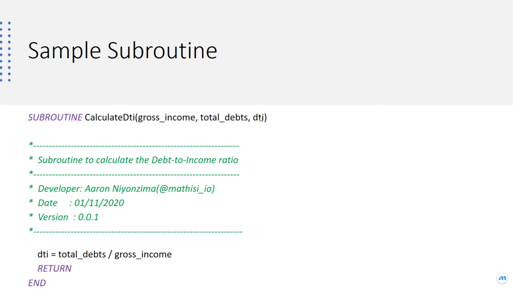
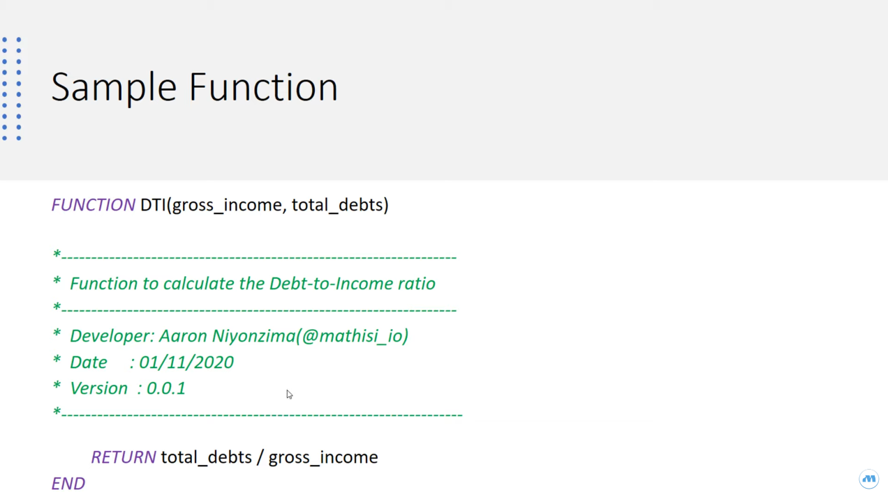

# Difference between Subroutine and Functions

## Sample routine

## Sample function

You can watch this video

[4. T24 Programming Training Series | Key concepts of Subroutines and Functions](https://youtu.be/U4E4lOsqsEw)
