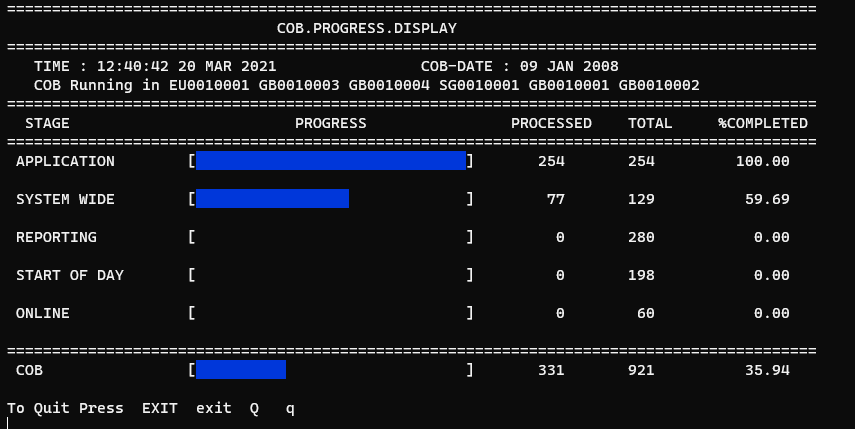

# CLOSE OF BUSINESS IN TEMENOS T24

## Objectives

- Understand the purpose of COB and how it is configured
- Stages of COB (Close of Business) in T24
- Run and Monitor the progress of COB in T24

## Stages of Close of Business in T24

- `A` : Application
- `S` : System Wide
- `R` : Reporting
- `D` : Start of Day
- `O` : Online

## Configure COB

- Ensure holidays are properly defined in `HOLIDAY`
- Configure batch jobs `BATCH`
- Create an entry in `TSA.WORKLOAD.PROFILE` with # of agents required for running COB

## Running and monitoring COB

- Start TSM service
- Start COB service
- Use T24 `COB.MONITOR` application to monitor the progress
- In case of error:
  - Check details in EB.EOD.ERROR (and in COMO)
  - Solve the error and resume COB

`TSA.SERVICE>TSM`

```
------------------------------------------------------------------------------
   1. 1 DESCRIPTION.... TSM Record for running upgrade as service
   2. 1 SERVER.NAME....
   3. 1 WORK.PROFILE... TSM                 WORK LOAD PROFILE FOR TSM
   4 USER.............. INPUTTER            INPUTTER
   5 SERVICE.CONTROL... START
   6 REVIEW.TIME.......
   7 TIME.OUT..........
```

`TSA.SERVICE>COB`

```
    SERVICE........... COB
 ------------------------------------------------------------------------------
   1. 1 DESCRIPTION.... FOR COB
   2. 1 SERVER.NAME....
   3. 1 WORK.PROFILE... TWO                 FOR COB
   4 USER.............. INPUTTER            INPUTTER
   5 SERVICE.CONTROL... START
   6 REVIEW.TIME.......
   7 TIME.OUT..........
```

### Start TSM

```
jsh t24 ~ -->START.TSM
START.TSM
Phantom process started on process id 4800
 [4800] Done : tSA 1
```

To start TSM in DEBUG mode, add DEBUG to the above command:

```
jsh t24 ~ -->START.TSM -DEBUG
```

### Monitor COB progress


