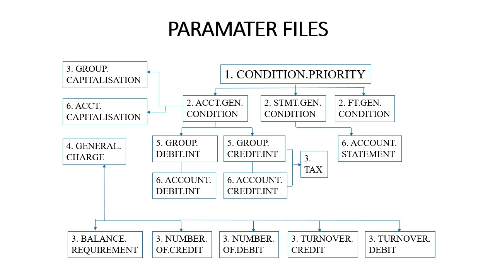

# T24 Business Training

## Customer
1. COUNTRY
2. SECTOR
3. INDUSTRY
4. TARGET
5. LANGUAGE
6. TAX
7. CUSTOMER.LIABILITY
## Account
1. CUSTOMER
2. CATEGORY
3. CURRENCY
4. DEPT.ACCT.OFFICER
5. ACCT.GEN.CONDITION
## Categories
### Customers Accounts ( 01 - 09)

### Internal Accounts ( 10 - 19)

### Contracts(20-21)

### P & L
1. Interests & charges (50 - 59)
2. Expenses (60 - 64)

## Parameter tables

## Charges and Interests

## Capitalisation

## Statements
1. AC.STMT.PARAMETER
2. STMT.GEN.​CONDITION
3. ACCOUNT.​STATEMENT

